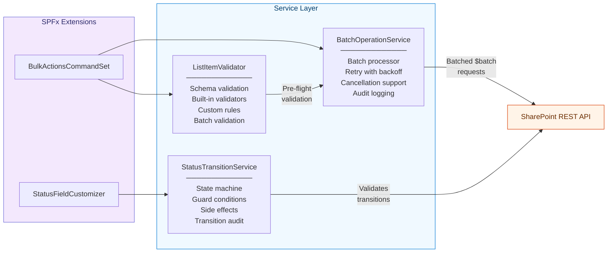
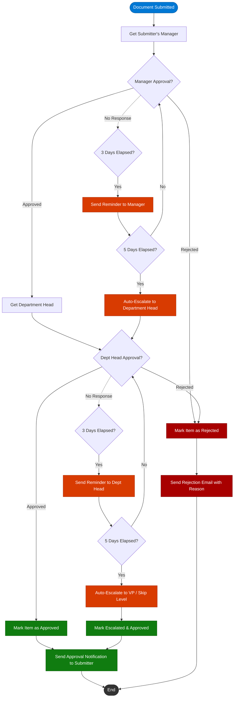

# SharePoint Workflow Automation


A production-ready SharePoint Online solution demonstrating list-based workflow management with Power Automate flows, SPFx extensions, and PnP provisioning templates. Built to showcase enterprise patterns for approval routing, status tracking, cross-list synchronization, and automated lifecycle management.

## Overview

This project provides a complete, deployable workflow automation platform on SharePoint Online. It combines four custom SharePoint lists, five Power Automate cloud flows, and two SPFx extensions into a cohesive solution that handles the full lifecycle of project tracking, document approvals, change requests, and employee onboarding.

## Architecture

```mermaid
graph TD
    subgraph SP["SharePoint Online Site"]
        subgraph Lists["SharePoint Lists"]
            L1["Project Tracker<br/>8 fields, 5 views"]
            L2["Document Approval Queue<br/>9 fields, 4 views"]
            L3["Change Request Log<br/>10 fields, 5 views"]
            L4["Employee Onboarding<br/>9 fields, 4 views"]
            L5["Workflow Audit Log<br/>Logging & history"]
            L6["Archive List<br/>Completed items"]
        end

        subgraph SPFx["SPFx Extensions"]
            EXT1["Bulk Actions<br/>Command Set<br/>─────────────<br/>Bulk Approve<br/>Export to CSV<br/>Assign To"]
            EXT2["Status Field<br/>Customizer<br/>─────────────<br/>Color-coded badges<br/>ARIA accessible<br/>5 status states"]
        end
    end

    subgraph PA["Power Automate Cloud Flows"]
        F1["Multi-Stage Approval<br/>Trigger: Item created/modified<br/>2-stage approval with escalation"]
        F2["Conditional Notifications<br/>Trigger: Item created<br/>Priority-based routing"]
        F3["Weekly Status Report<br/>Trigger: Recurrence Mon 8 AM<br/>HTML report + PDF + email"]
        F4["Cross-List Sync<br/>Trigger: Item modified<br/>Hub-spoke synchronization"]
        F5["Lifecycle Management<br/>Trigger: Daily 6 AM<br/>Archive, remind, mark overdue"]
    end

    subgraph PnP["PnP Provisioning"]
        P1["Deploy-WorkflowSolution.ps1<br/>Create site, provision lists,<br/>deploy SPFx, configure views"]
        P2["Remove-WorkflowSolution.ps1<br/>Remove lists, retract app,<br/>clean up content types"]
    end

    EXT1 -->|"Toolbar actions<br/>on list items"| L1
    EXT1 -->|"Toolbar actions"| L2
    EXT1 -->|"Toolbar actions"| L3
    EXT2 -->|"Renders status<br/>badges inline"| L1
    EXT2 -->|"Renders badges"| L2
    EXT2 -->|"Renders badges"| L3
    EXT2 -->|"Renders badges"| L4

    F1 -->|"Creates/updates<br/>approval status"| L2
    F2 -->|"Reads priority,<br/>sends alerts"| L1
    F3 -->|"Queries all lists<br/>for report data"| Lists
    F4 -->|"Syncs hub data<br/>to spoke lists"| L1
    F4 -->|"Logs sync operations"| L5
    F5 -->|"Archives items,<br/>updates status"| L1
    F5 -->|"Moves completed items"| L6
    F5 -->|"Logs actions"| L5

    P1 -.->|"Provisions"| Lists
    P1 -.->|"Deploys"| SPFx
    P2 -.->|"Removes"| Lists
    P2 -.->|"Retracts"| SPFx

    style SP fill:#e8f4fd,stroke:#0078d4,stroke-width:2px,color:#003d6b
    style Lists fill:#f0f9ff,stroke:#0078d4,color:#003d6b
    style SPFx fill:#f0f9ff,stroke:#0078d4,color:#003d6b
    style PA fill:#f3e8fd,stroke:#6b69d6,stroke-width:2px,color:#2d2b6b
    style PnP fill:#fff4e8,stroke:#d83b01,stroke-width:2px,color:#6b2d00
```



> Full architecture diagram with styling: [`docs/diagrams/architecture.md`](docs/diagrams/architecture.md)

### Service Layer



## Features

### SPFx Extensions

- **Bulk Actions Command Set** -- ListView toolbar buttons for multi-item operations
  - Bulk Approve: Update status on all selected items in a single batched request
  - Export to CSV: Download selected items as a UTF-8 CSV file with BOM
  - Assign To: Open a people picker panel to reassign items in bulk
  - **Progress Panel**: Real-time progress bar during bulk operations with item-by-item status, error details, per-item and bulk retry, cancel button, and completion summary

- **Status Field Customizer** -- Color-coded badge rendering for status columns
  - Not Started (gray), In Progress (blue), Under Review (orange), Approved (green), Rejected (red)
  - Accessible with ARIA labels and semantic HTML
  - Automatically applied to all provisioned lists

### SharePoint List Templates

- **Project Tracker** -- Track projects with status, priority, assignments, due dates, and completion percentage
- **Document Approval Queue** -- Manage document review workflows with submitter/reviewer tracking
- **Change Request Log** -- Log change requests with impact assessment, system categorization, and resolution tracking
- **Employee Onboarding Checklist** -- Department-based onboarding task management for new hires
- **IT Asset Tracking** -- Hardware asset lifecycle management with serial numbers, warranty tracking, department assignment, and status monitoring

### Power Automate Flows

- **Multi-Stage Approval** -- Two-stage approval (manager then department head) with 3-day reminder and 5-day auto-escalation
- **Conditional Notifications** -- Priority-based routing: High = Teams + email, Medium = Teams, Low = weekly digest queue
- **Weekly Status Report** -- Generates an HTML report with summary cards, converts to PDF, saves to SharePoint, and emails stakeholders
- **Cross-List Sync** -- Hub-to-spoke data synchronization with hub-wins conflict resolution and audit logging
- **Lifecycle Management** -- Daily archival of 90-day-old completed items, due-date reminders, and overdue status updates
- **Teams Adaptive Card Approval** -- Posts an Adaptive Card to Teams with item details, approve/reject buttons, handles response directly in Teams, updates SharePoint item status, and sends confirmation card

## Flow Diagrams

Detailed Mermaid diagrams for each Power Automate flow:

| Flow | Diagram | Description |
|------|---------|-------------|
| Multi-Stage Approval | [`docs/flow-diagrams/multi-stage-approval.md`](docs/flow-diagrams/multi-stage-approval.md) | Two-stage approval with escalation paths |
| Conditional Notifications | [`docs/flow-diagrams/conditional-notifications.md`](docs/flow-diagrams/conditional-notifications.md) | Priority-based notification routing |
| Cross-List Sync | [`docs/flow-diagrams/cross-list-sync.md`](docs/flow-diagrams/cross-list-sync.md) | Hub-spoke synchronization with conflict resolution |
| Lifecycle Management | [`docs/flow-diagrams/lifecycle-management.md`](docs/flow-diagrams/lifecycle-management.md) | Daily archival, reminders, and overdue detection |

### Multi-Stage Approval Flow



## Screenshots

Interactive HTML mockups of the solution UI. Open each file in a browser to view.

| Mockup | File | Description |
|--------|------|-------------|
| **Hero: Full Solution** | [`docs/screenshots/hero-workflow.html`](docs/screenshots/hero-workflow.html) | Split-view hero screenshot: SharePoint list with bulk actions + Power Automate flow running + Teams approval card. Dark theme with animations. |
| Project Tracker List | [`docs/screenshots/project-tracker.html`](docs/screenshots/project-tracker.html) | Full SharePoint list view with status badges, priority indicators, progress bars, and grouped-by-status layout |
| Bulk Actions | [`docs/screenshots/bulk-actions.html`](docs/screenshots/bulk-actions.html) | Multi-select with bulk approve toolbar, loading overlay, and success toast notification |
| Assign Panel | [`docs/screenshots/assign-panel.html`](docs/screenshots/assign-panel.html) | Fluent UI side panel with people picker, person suggestions, and assignment processing |
| Approval Flow Run | [`docs/screenshots/approval-flow.html`](docs/screenshots/approval-flow.html) | Power Automate flow run timeline showing all 6 steps succeeded with approval outcomes |
| Status Badges | [`docs/screenshots/status-badges.html`](docs/screenshots/status-badges.html) | Showcase of all 5 status badge states with in-context list preview and technical details |

## Status Badge Reference

The Status Field Customizer renders color-coded badges for the following states:

| Status | Color | Hex Code | CSS Class |
|--------|-------|----------|-----------|
| **Not Started** | Gray | `#808080` | `.status-badge--not-started` |
| **In Progress** | Blue | `#0078d4` | `.status-badge--in-progress` |
| **Under Review** | Orange | `#d83b01` | `.status-badge--under-review` |
| **Approved** | Green | `#107c10` | `.status-badge--approved` |
| **Rejected** | Red | `#a80000` | `.status-badge--rejected` |

All badges meet WCAG 2.1 AA contrast requirements (minimum 4.5:1 ratio) and include `role="status"` with `aria-label` attributes.

> Full reference with CSS and accessibility details: [`docs/diagrams/status-badges.md`](docs/diagrams/status-badges.md)

## Prerequisites

| Requirement | Version | Notes |
|-------------|---------|-------|
| Node.js | 18.x LTS | Required for SPFx build |
| SharePoint Online | -- | Microsoft 365 E3/E5 or SharePoint Online Plan 2 |
| Power Automate | -- | Per-user or per-flow plan (premium connector needed for PDF) |
| PnP.PowerShell | 2.x+ | `Install-Module PnP.PowerShell` |
| SPFx development environment | 1.22 | Gulp, Yeoman, TypeScript 4.7 |
| Tenant App Catalog | -- | Required for SPFx deployment |

## Deployment

### Step 1: Clone the repository

```bash
git clone https://github.com/your-org/sharepoint-workflow-automation.git
cd sharepoint-workflow-automation
```

### Step 2: Build the SPFx package

```bash
cd spfx-extensions
npm install
npm run package
```

This produces `sharepoint/solution/sharepoint-workflow-extensions.sppkg`.

### Step 3: Run the deployment script

```powershell
# Basic deployment (lists + SPFx)
.\provisioning\Deploy-WorkflowSolution.ps1 `
    -SiteUrl "https://contoso.sharepoint.com/sites/workflow-demo"

# Full deployment with site creation
.\provisioning\Deploy-WorkflowSolution.ps1 `
    -SiteUrl "https://contoso.sharepoint.com/sites/workflow-demo" `
    -TenantAdminUrl "https://contoso-admin.sharepoint.com" `
    -CreateSite

# Dry run (no changes)
.\provisioning\Deploy-WorkflowSolution.ps1 `
    -SiteUrl "https://contoso.sharepoint.com/sites/workflow-demo" `
    -WhatIf
```

### Step 4: Import Power Automate flows

1. Go to [Power Automate](https://make.powerautomate.com)
2. Select **My flows** > **Import**
3. Upload each `.json` file from `power-automate-flows/`
4. Configure connections and update parameters (see `power-automate-flows/README.md`)

### Step 5: Verify

- Navigate to the site and confirm all four lists are created
- Open the Project Tracker list -- you should see the Bulk Actions toolbar buttons
- Confirm status columns render as colored badges
- Create a test item to verify Power Automate flow triggers

## List Template Reference

| List | Purpose | Fields | Views | Content Type |
|------|---------|--------|-------|--------------|
| Project Tracker | Track projects and assignments | 8 | 5 (All Items, My Projects, Active, Overdue, By Status) | ProjectItem |
| Document Approval Queue | Document review workflow | 9 | 4 (All Items, Pending, My Submissions, Recently Reviewed) | ApprovalItem |
| Change Request Log | Change management tracking | 10 | 5 (All, Open, My Requests, By System, By Impact) | ChangeRequest |
| Employee Onboarding | New hire task checklist | 9 | 4 (All Tasks, By Department, By New Hire, Incomplete) | OnboardingTask |
| IT Asset Tracking | Hardware asset lifecycle management | 10 | 5 (All Assets, By Department, By Type, Warranty Expiring, Retired Assets) | ITAssetItem |

## Flow Reference

| Flow | Trigger | Key Actions | Connectors |
|------|---------|-------------|------------|
| Multi-Stage Approval | Item created/modified | Get manager, 2-stage approval, escalation | SharePoint, Approvals, Office 365, Users |
| Conditional Notifications | Item created | Priority switch, Teams post, email, digest queue | SharePoint, Teams, Office 365, Users |
| Weekly Status Report | Recurrence (Mon 8 AM) | Query items, HTML table, PDF convert, email | SharePoint, Encodian, Office 365 |
| Cross-List Sync | Item modified | Match spoke items, hub-wins update, audit log | SharePoint |
| Lifecycle Management | Recurrence (daily 6 AM) | Archive old items, send reminders, mark overdue | SharePoint, Office 365 |
| Teams Adaptive Card Approval | Item created/modified (status = Pending) | Post Adaptive Card, handle response, update item, send confirmation | SharePoint, Teams, Office 365 |

## SPFx Extension Reference

| Extension | Type | Actions/Behavior |
|-----------|------|------------------|
| BulkActionsCommandSet | ListView Command Set | Bulk Approve, Export (CSV/Excel/JSON with column selection), Assign To, Progress Panel |
| StatusFieldCustomizer | Field Customizer | Color-coded badges for Not Started, In Progress, Under Review, Approved, Rejected |

## Architecture Decision Records

Key architectural decisions are documented as ADRs in [`docs/adr/`](docs/adr/):

| ADR | Decision | Status |
|-----|----------|--------|
| [001](docs/adr/001-command-set-over-custom-page.md) | Use SPFx Command Set over custom application page for bulk actions | Accepted |
| [002](docs/adr/002-pnp-batching-strategy.md) | Use PnP batched operations for bulk updates (N calls to 1) | Accepted |
| [003](docs/adr/003-flow-escalation-pattern.md) | Parallel branch escalation pattern for approval flows | Accepted |

## Advanced Patterns

### Batch Processing Service

`spfx-extensions/src/extensions/bulkActions/services/BatchOperationService.ts`

A generic batch processor for SharePoint list item operations with enterprise-grade reliability:

- **Generic API**: `batchProcess<T>(items, processor, options, onProgress)` works with any item type
- **Configurable concurrency**: Process up to N batches in parallel (default: 5)
- **Exponential backoff retry**: Failed items automatically retry up to 3 times with increasing delays
- **Cancellation support**: Pass an `AbortSignal` to cancel mid-operation
- **SharePoint throttling**: Detects HTTP 429 responses and respects `Retry-After` headers
- **Progress callbacks**: Real-time progress with per-item status (Pending, Processing, Succeeded, Failed, Retrying, Cancelled)
- **Audit logging**: Generates audit entries for every item operation, persistable to the Workflow Audit Log list
- **Retry failed**: `retryFailed()` method re-processes only the items that failed in a previous batch

### Status Transition State Machine

`spfx-extensions/src/extensions/statusField/services/StatusTransitionService.ts`

A type-safe state machine that governs all status field transitions:

- **Defined transitions**: Not Started -> In Progress -> Under Review -> Approved/Rejected, with On Hold and Cancelled branches
- **Guard conditions**: Custom async validators that can block a transition (e.g., "all subtasks must be complete")
- **Side effects**: Register async actions triggered on transition (send notification, update related list, log audit entry)
- **Role-based access**: Restrict transitions to specific roles (e.g., only Approvers can move to Approved)
- **Reason requirements**: Force users to provide justification for certain transitions (e.g., Rejection requires a reason)
- **Audit trail**: Full history of every transition with timestamps, actors, and side effect outcomes

### Data Validation Layer

`spfx-extensions/src/extensions/bulkActions/validators/ListItemValidator.ts`

Schema-based validation framework for list items, run before any bulk operation:

- **Schema per content type**: Register validation rules for ProjectItem, ApprovalItem, ChangeRequest, etc.
- **Built-in validators**: `required`, `maxLength`, `minLength`, `dateRange`, `choiceValues`, `personExists`, `numberRange`, `pattern`
- **Custom validators**: `Validators.custom()` for arbitrary business logic
- **Batch validation**: `validateBatch()` validates all selected items and separates valid/invalid before processing
- **Typed results**: `ValidationResult` with field-level errors and warnings, severity levels, and the rule that triggered each issue

## Monitoring

### Flow Health Dashboard

`provisioning/Monitor-FlowHealth.ps1`

PowerShell script that monitors all Power Automate flow runs and generates an HTML health dashboard:

```powershell
# Check flow health for the last 7 days
.\provisioning\Monitor-FlowHealth.ps1 `
    -EnvironmentId "a1b2c3d4-e5f6-7890-abcd-ef1234567890" `
    -Days 7

# Generate report for specific flows, email results
.\provisioning\Monitor-FlowHealth.ps1 `
    -EnvironmentId $envId `
    -Days 30 `
    -FlowFilter "Workflow*" `
    -OutputPath "C:\Reports\flow-health.html" `
    -SendEmail -SmtpServer "smtp.contoso.com" `
    -EmailTo "ops@contoso.com" -EmailFrom "monitor@contoso.com"
```

**Dashboard features:**
- Per-flow success rate with color-coded health status (Healthy >= 95%, Warning >= 80%, Critical < 80%)
- Failed run details with error messages
- Stale flow detection (no runs in 3+ days)
- Summary metrics: total runs, success rate, healthy/warning/critical/stale counts
- Self-contained HTML output with dark theme
- Optional email delivery with high-priority flag for critical flows

## Project Structure

```
sharepoint-workflow-automation/
├── spfx-extensions/               # SPFx project
│   ├── config/                    # SPFx build configuration
│   ├── src/extensions/
│   │   ├── bulkActions/           # ListView Command Set
│   │   │   ├── components/        # React components (AssignPanel, ExportDialog, ProgressPanel)
│   │   │   ├── services/
│   │   │   │   └── BatchOperationService.ts   # Batch processor with retry, cancellation, audit
│   │   │   ├── validators/
│   │   │   │   └── ListItemValidator.ts       # Schema-based validation framework
│   │   │   ├── BulkActionsCommandSet.ts
│   │   │   └── BulkActionsCommandSet.manifest.json
│   │   └── statusField/           # Field Customizer
│   │       ├── components/        # React components (StatusBadge)
│   │       ├── services/
│   │       │   └── StatusTransitionService.ts  # State machine for status transitions
│   │       ├── StatusFieldCustomizer.ts
│   │       └── StatusFieldCustomizer.manifest.json
│   ├── package.json
│   ├── tsconfig.json
│   └── gulpfile.js
├── list-templates/                # PnP provisioning XML
│   ├── project-tracker.xml
│   ├── document-approval.xml
│   ├── change-request.xml
│   ├── employee-onboarding.xml
│   └── it-asset-tracking.xml
├── power-automate-flows/          # Flow definitions (Logic Apps JSON)
│   ├── multi-stage-approval.json
│   ├── conditional-notifications.json
│   ├── scheduled-report.json
│   ├── cross-list-sync.json
│   ├── lifecycle-management.json
│   ├── teams-adaptive-card-approval.json  # Teams Adaptive Card approval flow
│   └── README.md
├── provisioning/                  # Deployment & operations scripts
│   ├── Deploy-WorkflowSolution.ps1
│   ├── Remove-WorkflowSolution.ps1
│   ├── Set-ListPermissions.ps1
│   ├── New-SiteFromTemplate.ps1   # Site provisioning from PnP template
│   └── Monitor-FlowHealth.ps1    # Flow health monitoring + HTML dashboard
├── docs/
│   ├── adr/                       # Architecture Decision Records
│   │   ├── 001-command-set-over-custom-page.md
│   │   ├── 002-pnp-batching-strategy.md
│   │   └── 003-flow-escalation-pattern.md
│   ├── diagrams/                  # Architecture & component diagrams
│   │   ├── architecture.md
│   │   └── status-badges.md
│   ├── flow-diagrams/             # Power Automate flow diagrams
│   │   ├── multi-stage-approval.md
│   │   ├── conditional-notifications.md
│   │   ├── cross-list-sync.md
│   │   └── lifecycle-management.md
│   └── screenshots/               # HTML mockup screenshots
│       ├── hero-workflow.html     # Full solution hero screenshot (animated)
│       ├── project-tracker.html
│       ├── bulk-actions.html
│       ├── assign-panel.html
│       ├── approval-flow.html
│       └── status-badges.html
├── .gitignore
└── README.md
```

## Cleanup

To remove the solution from a dev/test environment:

```powershell
# Preview what will be removed
.\provisioning\Remove-WorkflowSolution.ps1 `
    -SiteUrl "https://contoso.sharepoint.com/sites/workflow-demo" `
    -RemoveLists -RemoveApp -WhatIf

# Execute removal
.\provisioning\Remove-WorkflowSolution.ps1 `
    -SiteUrl "https://contoso.sharepoint.com/sites/workflow-demo" `
    -RemoveLists -RemoveApp -Force
```

## Contributing

See **[CONTRIBUTING.md](CONTRIBUTING.md)** for prerequisites, setup instructions, development workflow, and code style guidelines.

---

## Changelog

### v1.3.0

- Added `BatchOperationService.ts` -- generic batch processor with configurable concurrency, exponential backoff retry, cancellation token (AbortSignal), SharePoint throttling detection, and audit log generation
- Added `StatusTransitionService.ts` -- type-safe state machine for status transitions with guard conditions, side effects, role-based access, reason requirements, and full audit trail
- Added `ListItemValidator.ts` -- schema-based validation framework with built-in validators (required, maxLength, dateRange, choiceValues, personExists, numberRange, pattern) and batch validation
- Added `Monitor-FlowHealth.ps1` -- Power Automate flow health monitoring script with per-flow success rates, failed run details, stale flow detection, and self-contained HTML dashboard output with optional email delivery
- Added Architecture Decision Records: ADR-001 (Command Set over custom page), ADR-002 (PnP batching strategy), ADR-003 (parallel branch escalation pattern)
- Added `hero-workflow.html` -- animated hero screenshot with split-view layout showing SharePoint list, Power Automate flow run, Teams approval card, and batch progress panel

### v1.2.0

- Added `ProgressPanel.tsx` batch operation progress panel with real-time progress bar, item-by-item status tracking, error details with per-item and bulk retry, cancel operation, and completion summary
- Added `teams-adaptive-card-approval.json` Power Automate flow for Teams-based approvals with Adaptive Cards, in-Teams response handling, SharePoint status updates, and confirmation cards
- Added `New-SiteFromTemplate.ps1` provisioning script for end-to-end site creation from PnP templates with list provisioning, theme, permissions, SPFx extension registration, and post-deployment report

### v1.1.0

- Added IT Asset Tracking list template with 10 fields and 5 views (All Assets, By Department, By Type, Warranty Expiring, Retired Assets)
- Added Export Dialog component with format selection (CSV/Excel/JSON), column checkboxes, and date range filtering
- Added `Set-ListPermissions.ps1` for single or bulk permission management with JSON config support
- Updated SPFx extension reference to reflect enhanced export capabilities

### v1.0.0

- Four list templates: Project Tracker, Document Approval Queue, Change Request Log, Employee Onboarding
- SPFx extensions: Bulk Actions Command Set (Bulk Approve, Export to CSV, Assign To) and Status Field Customizer
- Five Power Automate flows: Multi-Stage Approval, Conditional Notifications, Weekly Status Report, Cross-List Sync, Lifecycle Management
- PnP provisioning and removal scripts
- Architecture diagrams, flow diagrams, and HTML screenshot mockups

---

## Roadmap

Planned features for future releases:

- **Approval dashboard web part** -- SPFx web part showing pending approvals across all lists with one-click approve/reject
- **Microsoft Teams integration** -- Adaptive Cards for approval requests and status notifications in Teams channels
- **Mobile-optimized views** -- Responsive list views and SPFx extensions optimized for SharePoint mobile app
- **Power Automate flow templates** -- Additional flows for SLA tracking, capacity planning, and vendor management
- **Bulk import/export tool** -- PowerShell script for bulk-populating lists from CSV with field mapping

---

## License

This project is licensed under the MIT License.

```
MIT License

Copyright (c) 2026

Permission is hereby granted, free of charge, to any person obtaining a copy
of this software and associated documentation files (the "Software"), to deal
in the Software without restriction, including without limitation the rights
to use, copy, modify, merge, publish, distribute, sublicense, and/or sell
copies of the Software, and to permit persons to whom the Software is
furnished to do so, subject to the following conditions:

The above copyright notice and this permission notice shall be included in all
copies or substantial portions of the Software.

THE SOFTWARE IS PROVIDED "AS IS", WITHOUT WARRANTY OF ANY KIND, EXPRESS OR
IMPLIED, INCLUDING BUT NOT LIMITED TO THE WARRANTIES OF MERCHANTABILITY,
FITNESS FOR A PARTICULAR PURPOSE AND NONINFRINGEMENT. IN NO EVENT SHALL THE
AUTHORS OR COPYRIGHT HOLDERS BE LIABLE FOR ANY CLAIM, DAMAGES OR OTHER
LIABILITY, WHETHER IN AN ACTION OF CONTRACT, TORT OR OTHERWISE, ARISING FROM,
OUT OF OR IN CONNECTION WITH THE SOFTWARE OR THE USE OR OTHER DEALINGS IN THE
SOFTWARE.
```
