# Solution Architecture

This diagram shows the complete solution architecture, including all SharePoint lists, SPFx extensions, Power Automate flows, and PnP provisioning components.

```mermaid
graph TD
    subgraph SP["SharePoint Online Site"]
        subgraph Lists["SharePoint Lists"]
            L1["Project Tracker<br/>📋 8 fields, 5 views"]
            L2["Document Approval Queue<br/>📄 9 fields, 4 views"]
            L3["Change Request Log<br/>🔄 10 fields, 5 views"]
            L4["Employee Onboarding<br/>👤 9 fields, 4 views"]
            L5["Workflow Audit Log<br/>📝 Logging & history"]
            L6["Archive List<br/>🗄️ Completed items"]
        end

        subgraph SPFx["SPFx Extensions"]
            EXT1["Bulk Actions<br/>Command Set<br/>─────────────<br/>• Bulk Approve<br/>• Export to CSV<br/>• Assign To"]
            EXT2["Status Field<br/>Customizer<br/>─────────────<br/>• Color-coded badges<br/>• ARIA accessible<br/>• 5 status states"]
        end
    end

    subgraph PA["Power Automate Cloud Flows"]
        F1["Multi-Stage Approval<br/>─────────────────<br/>Trigger: Item created/modified<br/>2-stage approval with escalation"]
        F2["Conditional Notifications<br/>─────────────────────<br/>Trigger: Item created<br/>Priority-based routing"]
        F3["Weekly Status Report<br/>─────────────────<br/>Trigger: Recurrence Mon 8 AM<br/>HTML report + PDF + email"]
        F4["Cross-List Sync<br/>───────────────<br/>Trigger: Item modified<br/>Hub-spoke synchronization"]
        F5["Lifecycle Management<br/>───────────────────<br/>Trigger: Daily 6 AM<br/>Archive, remind, mark overdue"]
    end

    subgraph PnP["PnP Provisioning"]
        P1["Deploy-WorkflowSolution.ps1<br/>──────────────────────<br/>• Create site (optional)<br/>• Provision lists & content types<br/>• Deploy SPFx package<br/>• Configure views & fields"]
        P2["Remove-WorkflowSolution.ps1<br/>───────────────────────<br/>• Remove lists<br/>• Retract SPFx app<br/>• Clean up content types"]
    end

    %% SPFx to Lists connections
    EXT1 -->|"Toolbar actions<br/>on list items"| L1
    EXT1 -->|"Toolbar actions"| L2
    EXT1 -->|"Toolbar actions"| L3
    EXT2 -->|"Renders status<br/>badges inline"| L1
    EXT2 -->|"Renders badges"| L2
    EXT2 -->|"Renders badges"| L3
    EXT2 -->|"Renders badges"| L4

    %% Flow to Lists connections
    F1 -->|"Creates/updates<br/>approval status"| L2
    F2 -->|"Reads priority,<br/>sends alerts"| L1
    F2 -->|"Reads priority"| L3
    F3 -->|"Queries all lists<br/>for report data"| Lists
    F4 -->|"Syncs hub data<br/>to spoke lists"| L1
    F4 -->|"Logs sync<br/>operations"| L5
    F5 -->|"Archives items,<br/>updates status"| L1
    F5 -->|"Moves completed<br/>items"| L6
    F5 -->|"Logs actions"| L5

    %% PnP Provisioning connections
    P1 -.->|"Provisions"| Lists
    P1 -.->|"Deploys"| SPFx
    P2 -.->|"Removes"| Lists
    P2 -.->|"Retracts"| SPFx

    %% Styling
    style SP fill:#e8f4fd,stroke:#0078d4,stroke-width:2px,color:#003d6b
    style Lists fill:#f0f9ff,stroke:#0078d4,color:#003d6b
    style SPFx fill:#f0f9ff,stroke:#0078d4,color:#003d6b
    style PA fill:#f3e8fd,stroke:#6b69d6,stroke-width:2px,color:#2d2b6b
    style PnP fill:#fff4e8,stroke:#d83b01,stroke-width:2px,color:#6b2d00

    style L1 fill:#fff,stroke:#0078d4,color:#003d6b
    style L2 fill:#fff,stroke:#0078d4,color:#003d6b
    style L3 fill:#fff,stroke:#0078d4,color:#003d6b
    style L4 fill:#fff,stroke:#0078d4,color:#003d6b
    style L5 fill:#fff,stroke:#808080,color:#333
    style L6 fill:#fff,stroke:#808080,color:#333

    style EXT1 fill:#c7e0f4,stroke:#0078d4,color:#003d6b
    style EXT2 fill:#c7e0f4,stroke:#0078d4,color:#003d6b

    style F1 fill:#e8e0f4,stroke:#6b69d6,color:#2d2b6b
    style F2 fill:#e8e0f4,stroke:#6b69d6,color:#2d2b6b
    style F3 fill:#e8e0f4,stroke:#6b69d6,color:#2d2b6b
    style F4 fill:#e8e0f4,stroke:#6b69d6,color:#2d2b6b
    style F5 fill:#e8e0f4,stroke:#6b69d6,color:#2d2b6b

    style P1 fill:#ffe8d4,stroke:#d83b01,color:#6b2d00
    style P2 fill:#ffe8d4,stroke:#d83b01,color:#6b2d00
```

## Component Summary

| Layer | Components | Purpose |
|-------|-----------|---------|
| **SharePoint Lists** | 4 business lists + 2 system lists | Data storage and views |
| **SPFx Extensions** | Bulk Actions Command Set + Status Field Customizer | Browser-based UI enhancements |
| **Power Automate** | 5 cloud flows | Workflow automation and notifications |
| **PnP Provisioning** | Deploy + Remove scripts | Repeatable deployment and teardown |

## Data Flow

1. **PnP Provisioning** creates all lists, content types, views, and deploys the SPFx package.
2. **SPFx Extensions** enhance the browser experience with toolbar actions and status badges.
3. **Power Automate Flows** respond to list events (item creation, modification) and scheduled triggers.
4. All flow operations are logged to the **Workflow Audit Log** for traceability.
5. Completed items older than 90 days are moved to the **Archive List** by the Lifecycle Management flow.
