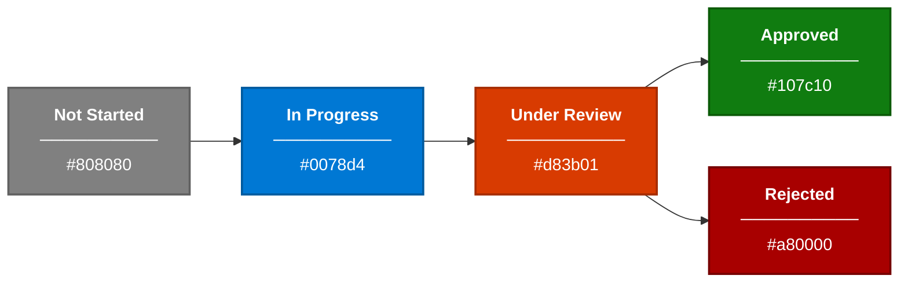

# Status Field Customizer

The Status Field Customizer is an SPFx Field Customizer that renders color-coded badges inline in SharePoint list views. It automatically detects the status value and applies the appropriate color, background, and ARIA label for accessibility.

## Status States



## Badge Reference

| Status | Background | Text Color | Hex Code | Usage |
|--------|-----------|------------|----------|-------|
| **Not Started** | Gray | White | `#808080` | Default state for newly created items |
| **In Progress** | Blue | White | `#0078d4` | Item is actively being worked on |
| **Under Review** | Orange | White | `#d83b01` | Item submitted for approval or review |
| **Approved** | Green | White | `#107c10` | Item has passed all approval stages |
| **Rejected** | Red | White | `#a80000` | Item was rejected during approval |

## Rendered Badge Examples

Each badge is rendered as an inline `<span>` with the following CSS properties:

```css
.status-badge {
    display: inline-block;
    padding: 2px 10px;
    border-radius: 12px;
    font-size: 12px;
    font-weight: 600;
    color: #ffffff;
    line-height: 1.5;
    white-space: nowrap;
}

.status-badge--not-started    { background-color: #808080; }
.status-badge--in-progress    { background-color: #0078d4; }
.status-badge--under-review   { background-color: #d83b01; }
.status-badge--approved       { background-color: #107c10; }
.status-badge--rejected       { background-color: #a80000; }
```

## Accessibility

- Each badge includes `role="status"` and an `aria-label` attribute (e.g., `aria-label="Status: Approved"`).
- Color contrast ratios meet WCAG 2.1 AA requirements (minimum 4.5:1).
- Badge text is not the sole indicator -- the status text label is always visible alongside the color.

## Automatic Application

The field customizer is automatically registered on the `Status` field of all provisioned lists via the PnP provisioning template. No manual configuration is needed after deployment.
