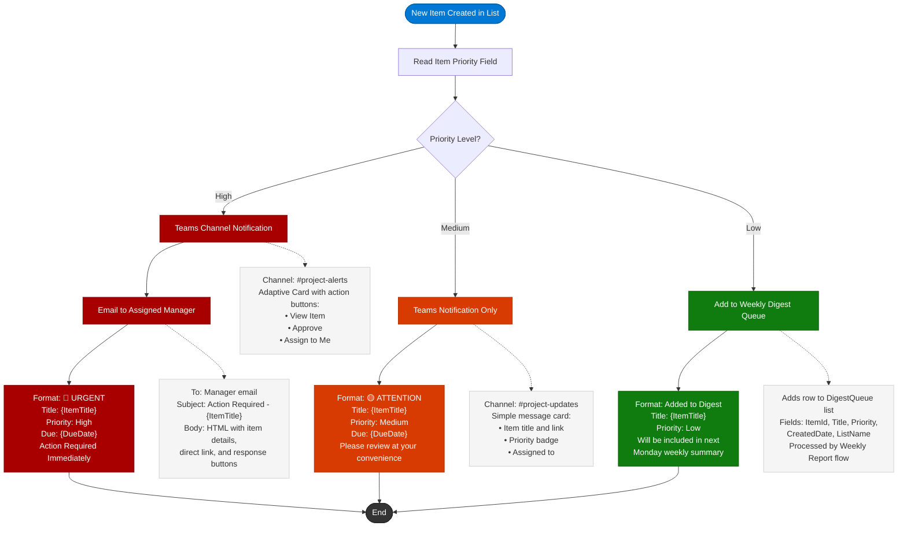

# Smart Notification Routing

This diagram shows how the **Conditional Notifications** Power Automate flow routes alerts based on item priority. High-priority items trigger immediate multi-channel notifications, while low-priority items are batched into a weekly digest.

## Notification Formats

| Priority | Channel | Format | Urgency |
|----------|---------|--------|---------|
| **High** | Teams Channel + Manager Email | Adaptive Card with action buttons + HTML email | Immediate response required |
| **Medium** | Teams Channel only | Simple message card with item link | Review at convenience |
| **Low** | Weekly Digest Queue | Batched into Monday summary report | Informational only |

## Configuration

The priority thresholds and notification targets are configured in the flow's environment variables:

- `TeamsChannelId_Alerts` -- Channel for high-priority notifications
- `TeamsChannelId_Updates` -- Channel for medium-priority notifications
- `DigestQueueListName` -- Name of the list used for weekly digest batching
- `ManagerLookupField` -- Field name used to resolve the assigned manager
