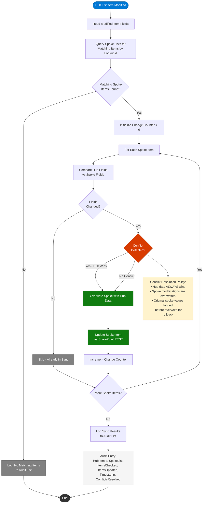

# Cross-List Data Synchronization

This diagram shows the **Cross-List Sync** Power Automate flow, which implements a hub-and-spoke synchronization pattern. When the hub list is modified, changes propagate to all matching spoke list items with hub-wins conflict resolution.

## Synchronization Rules

| Rule | Behavior |
|------|----------|
| **Direction** | One-way: Hub to Spoke(s) |
| **Trigger** | Any field modification on a Hub list item |
| **Matching** | Spoke items linked via `HubItemLookupId` column |
| **Conflict Resolution** | Hub data always wins; spoke values overwritten |
| **Audit Trail** | Every sync operation logged with before/after values |
| **Rollback** | Previous spoke values stored in audit log for manual rollback |

## Synchronized Fields

| Hub Field | Spoke Field | Sync Behavior |
|-----------|-------------|---------------|
| Title | Title | Direct copy |
| Status | Status | Direct copy |
| Priority | Priority | Direct copy |
| AssignedTo | AssignedTo | User lookup copy |
| DueDate | DueDate | Direct copy |
| Category | Category | Direct copy |

## Performance Notes

- The flow uses batched REST calls (`$batch` endpoint) to minimize API calls when updating multiple spoke items.
- A maximum of 50 spoke items are processed per run to stay within Power Automate API limits.
- If more than 50 matches exist, subsequent items are queued for the next trigger cycle.
