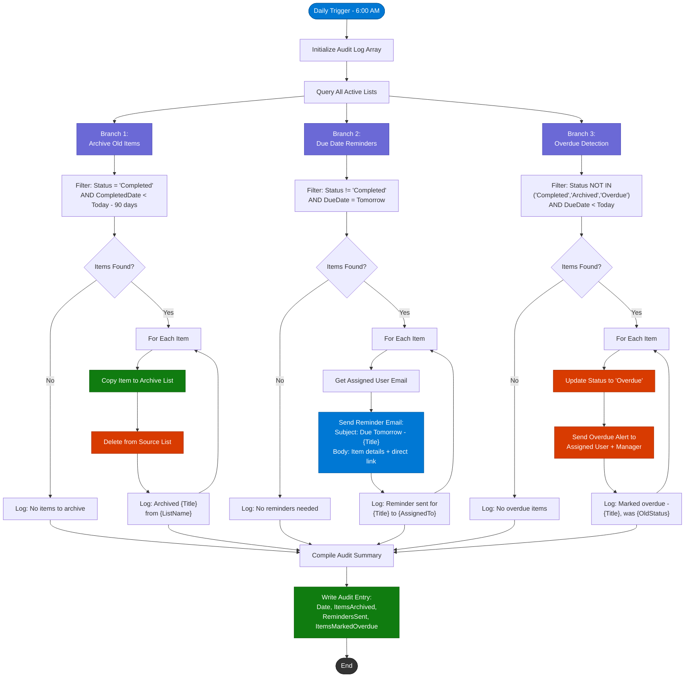

# Item Lifecycle Management

This diagram shows the **Lifecycle Management** Power Automate flow, which runs on a daily schedule to handle archival, reminders, and overdue status updates across all project lists.

## Daily Processing Summary

| Branch | Filter Criteria | Action | Notification |
|--------|----------------|--------|--------------|
| **Archive** | Status = Completed AND CompletedDate > 90 days ago | Copy to Archive list, delete from source | None (logged only) |
| **Reminders** | Status != Completed AND DueDate = Tomorrow | Send email reminder | Email to assigned user |
| **Overdue** | Status not terminal AND DueDate < Today | Update status to "Overdue" | Email to assigned user + their manager |

## Schedule

- **Trigger**: Daily recurrence at 6:00 AM (site timezone)
- **Estimated duration**: 2-5 minutes depending on item count
- **Retry policy**: 3 retries with exponential backoff on transient failures

## Audit Trail

Every run produces an audit entry in the `WorkflowAuditLog` list with:

| Field | Description |
|-------|-------------|
| `RunDate` | Timestamp of the flow run |
| `ItemsArchived` | Count of items moved to archive |
| `RemindersSent` | Count of reminder emails sent |
| `ItemsMarkedOverdue` | Count of items updated to Overdue status |
| `Errors` | Any errors encountered during processing |
| `Duration` | Total flow run time in seconds |
