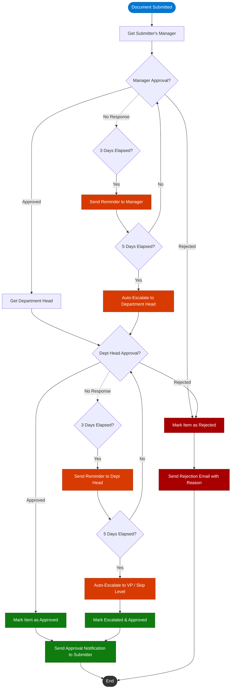

# Multi-Stage Document Approval Flow

This diagram illustrates the complete two-stage approval routing used by the **Multi-Stage Approval** Power Automate flow. Documents pass through manager review, then department head review, with automatic escalation if approvers are unresponsive.

## Flow Summary

| Stage | Approver | Timeout | Escalation Target |
|-------|----------|---------|-------------------|
| Stage 1 | Submitter's Manager | 3-day reminder, 5-day auto-escalate | Department Head |
| Stage 2 | Department Head | 3-day reminder, 5-day auto-escalate | VP / Skip Level |

## Key Behaviors

- **Rejection at any stage** terminates the flow and sends a rejection email with the approver's comments.
- **Approval at both stages** marks the document as Approved and notifies the original submitter.
- **Escalation** bypasses the unresponsive approver and moves the request to the next level in the hierarchy.
